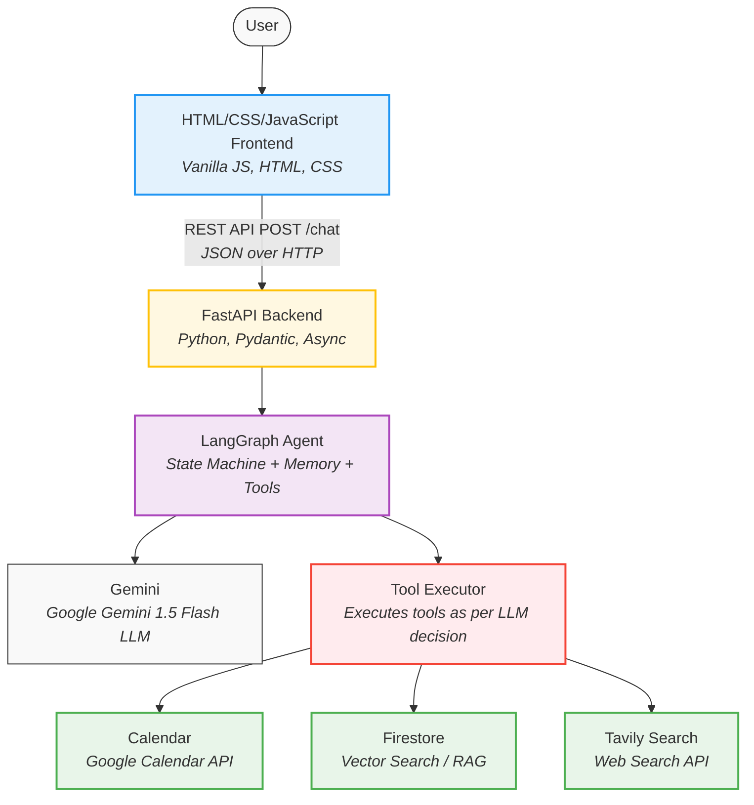

# Personal AI Agent

A fully-featured personal assistant built with **LangGraph + Google Gemini 1.5 Flash**. 
It features long-term memory, web search, and Google Calendar integration with human-in-the-loop safety controls.

 **Live Demo:** [https://personal-ai-agent-3abfc.web.app](https://personal-ai-agent-3abfc.web.app)

---

## Architecture Overview



The application follows a modern decoupled client-server architecture:

1. **Frontend (Client):** A lightweight Vanilla JavaScript, HTML, and CSS single-page application deployed on **Firebase Hosting**. It handles the UI, chat history rendering, and communicates with the backend via REST API.
2. **Backend (Server):** A **FastAPI** Python server deployed on **Render**. It exposes endpoints for chat interaction and memory testing.
3. **Agent Core:** Built using **LangGraph**, the agent utilizes a cyclic graph with a `thread_id` for short-term conversational memory. 
4. **LLM:** **Google Gemini 1.5 Flash** acts as the reasoning engine, deciding when to use tools, how to respond, and when to ask the user for clarification.
5. **Database (Long-term Memory):** **Firebase Firestore** with **Vector Search** is used to store and retrieve long-term user preferences via semantic similarity.

---

##  Candidate Decisions & Trade-offs

| Component | Choice | Rationale & Trade-offs |
| :--- | :--- | :--- |
| **LLM** | Google Gemini 1.5 Flash | Chosen for its generous free tier, extremely fast inference speed, and massive context window. *Trade-off:* Slightly lower reasoning capability on complex logic puzzles compared to GPT-4o or Claude 3.5 Sonnet, but perfect for a personal assistant. |
| **Agent Framework** | LangGraph | Chosen over AutoGen/CrewAI because of its granular control over state, cyclic tool execution, and built-in support for short-term memory (via SQLite checkpointing) and human-in-the-loop interrupts. |
| **Memory & Database** | Firebase Firestore (Vector Search) | Originally built with local ChromaDB, but migrated to Firestore Vector Search to support cloud deployment (PaaS like Render have ephemeral filesystems). *Trade-off:* Requires explicit index creation in GCP, but provides a scalable, managed, serverless database. |
| **Web Search** | Tavily API | Chosen because it is specifically optimized for LLMs, returning concise textual summaries instead of raw HTML that clutters the context window. |
| **Frontend** | Vanilla JS + CSS | Chosen for simplicity. A complex framework like React or Next.js would add unnecessary build steps and bundle size for a straightforward chat interface. Features a modern glassmorphism aesthetic. |

---

##  Memory Design

The agent utilizes a dual-memory system:
1. **Short-term Memory:** Managed automatically by LangGraph's `MemorySaver` using a local SQLite database (`data/agent_checkpoints.sqlite`). This allows the agent to remember context within a conversation thread without needing to query a database.
2. **Long-term Memory:** When the user explicitly asks the agent to remember a preference (e.g. "Remember my favorite color is blue"), the agent calls the `save_memory` tool. This embeds the fact and stores it in **Firestore** alongside a `metadata.user_id`. When answering personal questions, the agent calls `search_memory` to perform a semantic vector search filtered by the user's ID.

---

##  Confirmation & Safety Controls (Human-in-the-loop)

To prevent the agent from taking unauthorized destructive or scheduling actions, the **Google Calendar** integration implements a strict human-in-the-loop confirmation flow. 
When the user asks to schedule an event, the agent prepares the event details but does **not** execute the API call. Instead, it pauses and prompts the user with `[Confirm / Cancel]`. The frontend detects this state and locks the input, awaiting explicit user approval before proceeding.

---

##  Local Setup Instructions

### 1. Clone & Install Dependencies

```bash
git clone https://github.com/adil04imran/Personal-AI-Agent.git
cd "Personal Ai Agent"
python -m venv venv
source venv/bin/activate    # On Windows: venv\Scripts\activate
pip install -r requirements.txt
```

### 2. Configure Environment Variables
Create a `.env` file in the root directory:
```env
GOOGLE_API_KEY=your_gemini_api_key
TAVILY_API_KEY=your_tavily_api_key
USER_ID=default_user
```

### 3. Firebase Setup (Long-Term Memory)
1. Create a Firebase project and enable **Firestore Database**.
2. Go to Project Settings -> Service Accounts -> Generate New Private Key.
3. Save the downloaded JSON file as `backend/firebase-adminsdk.json`.
4. Create the required Composite Vector Index using the Google Cloud CLI or REST API for the `Memories` collection on `metadata.user_id` (ASCENDING) and `embedding` (VECTOR).

### 4. Google Calendar Setup (Optional)
1. Create a project in Google Cloud Console and enable the **Google Calendar API**.
2. Create an **OAuth 2.0 Client ID** (Desktop App).
3. Download the JSON and save it as `backend/credentials.json`.

### 5. Run the Application
```bash
# Start FastAPI backend
uvicorn backend.main:app --reload --port 8000
```
Then simply open `frontend/index.html` in your browser.

---

##  Sample Conversations

**1. Long-Term Memory & Deletion**
```text
You: Remember that my favorite sport is tennis.
Agent: [Memory] Got it! I've saved that your favorite sport is tennis. I'll keep that in mind!

You: What is my favorite sport?
Agent: Your favorite sport is tennis!

You: Forget my favorite sport.
Agent: [Memory] I've removed that from your memory! Is there anything else I can help you with today?
```

**2. Web Search & Multi-step Execution**
```text
You: Search for the latest Python release
Agent: [Web Search] Python 3.13 was released in October 2024...
```

**3. Calendar & Safety Controls**
```text
You: Schedule a team standup tomorrow at 10 AM for 30 minutes
Agent: I'll create this event:
   Team Standup
   Start: 2026-07-16T10:00:00
   End: 2026-07-16T10:30:00
  Should I go ahead? [Confirm / Cancel]

You: Yes
Agent: ✅ Event created! View it here: https://calendar.google.com/...
```
